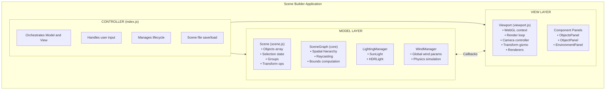
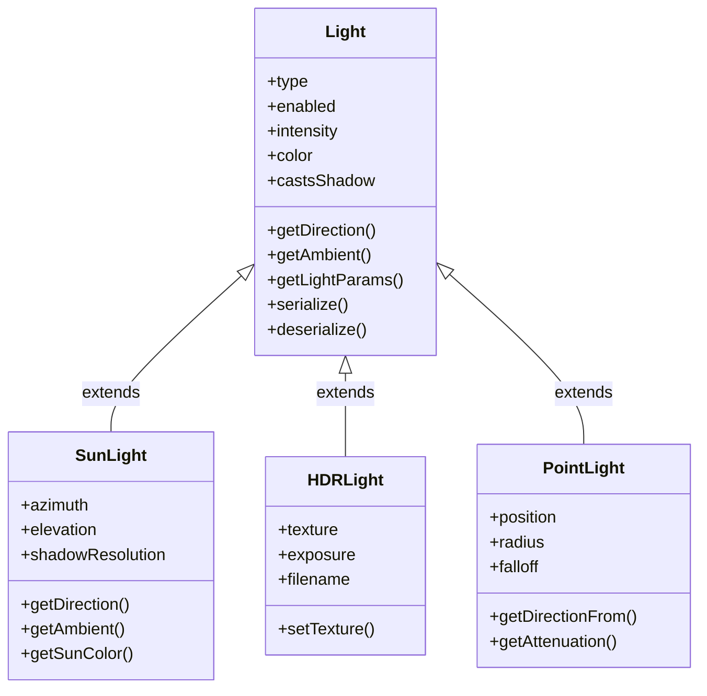
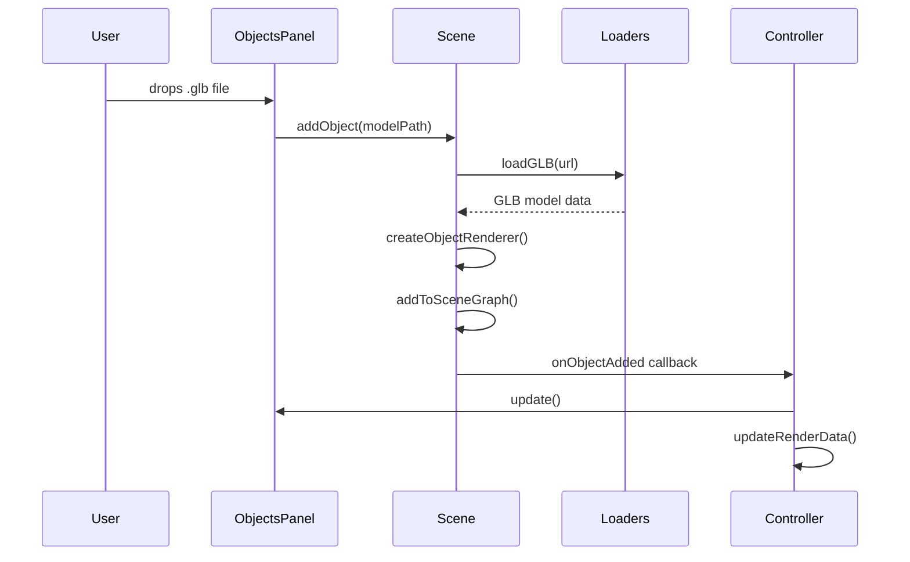
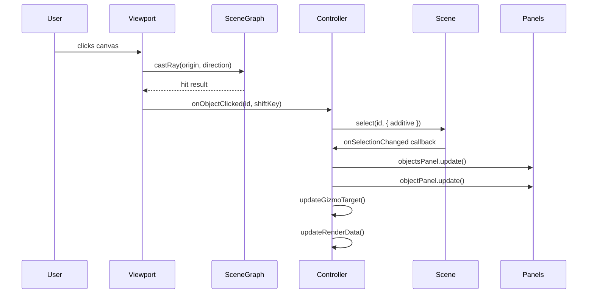
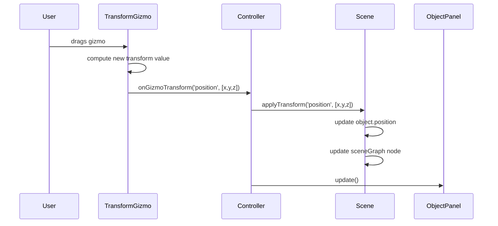
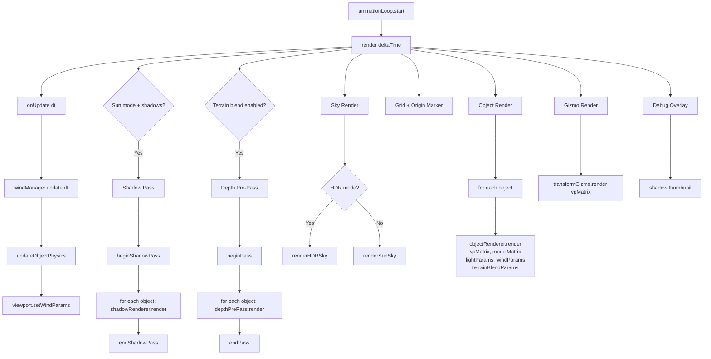
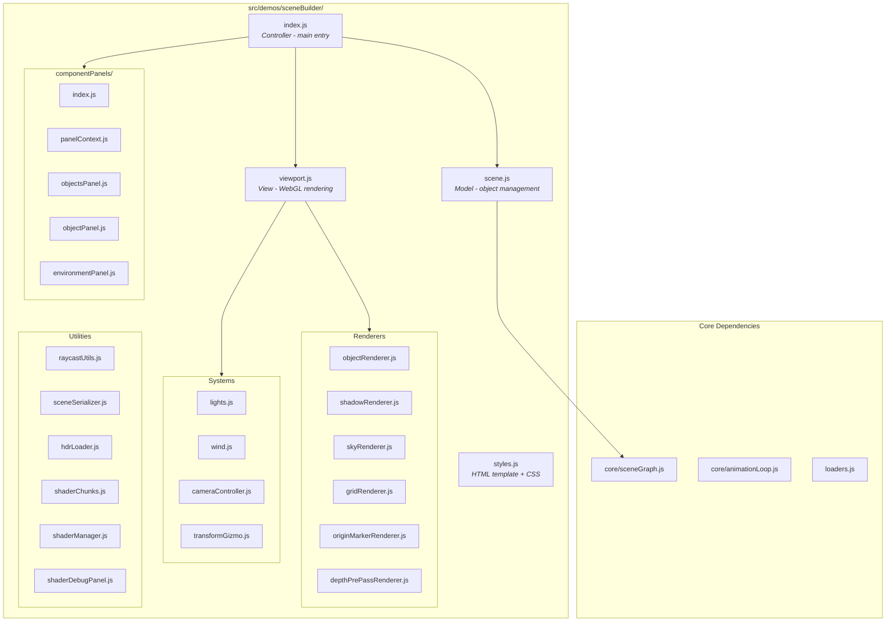
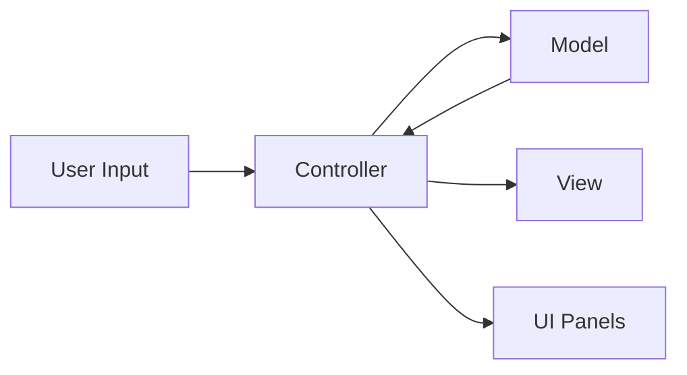

# Scene Builder Architecture Document

## Overview

The Scene Builder is a WebGL-based 3D scene composition tool that follows the **Model-View-Controller (MVC)** architecture pattern. It allows users to import GLB/GLTF models, position them in 3D space, configure lighting and wind effects, and save/load scenes.

## Architecture Diagram



---

## Core Components

### 1. Controller (`index.js`)

The central orchestrator that initializes all components and manages communication between Model and View.

**Responsibilities:**
- Create and wire up Model (Scene) and View (Viewport)
- Handle user input (keyboard shortcuts, menu bar)
- Manage scene file save/load operations
- Coordinate state sync between Model → View
- Instantiate UI panels with shared context

**Key Functions:**
```javascript
// Model → View sync
updateGizmoTarget()      // Sync selection to gizmo position
updateRenderData()       // Push objects/settings to viewport
updateLightingState()    // Push lighting params to viewport

// Event handlers (wired to Viewport callbacks)
handleGizmoTransform(type, value)   // Apply transform from gizmo
handleObjectClicked(objectId)        // Select object on click
handleUniformScaleChange(newScale)   // Scale from mouse drag
```

---

### 2. Model Layer

#### 2.1 Scene (`scene.js`)

The primary data model managing 3D objects, selection state, and groups.

**State:**
```javascript
{
  objects: [],          // Array of scene objects
  selectedIds: Set(),   // Currently selected object IDs
  groups: Map(),        // Group ID → { name, childIds, collapsed }
}
```

**Scene Object Structure:**
```javascript
{
  id: 'object-1',
  name: 'Tree',
  modelPath: '/models/tree.glb',
  model: GLBModel,                    // Parsed GLB data
  renderer: ObjectRenderer,            // GPU resources
  position: [0, 0, 0],
  rotation: [0, 45, 0],               // Degrees
  scale: [1, 1, 1],
  groupId: 'group-1' | null,
}
```

**Event Callbacks:**
```javascript
scene.onSelectionChanged = () => { ... }
scene.onObjectAdded = () => { ... }
scene.onObjectRemoved = () => { ... }
scene.onGroupChanged = () => { ... }
```

#### 2.2 SceneGraph (`core/sceneGraph.js`)

Spatial data structure for efficient raycasting and bounds queries.

**API:**
```javascript
sceneGraph.addNode(id, { position, rotation, scale, localBounds })
sceneGraph.updateNode(id, { position, rotation, scale })
sceneGraph.removeNode(id)
sceneGraph.castRay(origin, direction) → { node, distance }
```

#### 2.3 LightingManager (`lights.js`)

OOP lighting system with multiple light types.

**Class Hierarchy:**



**Key Methods:**
```javascript
lightingManager.setMode('sun' | 'hdr')
lightingManager.getLightParams()   // Returns shader uniforms
lightingManager.sunLight.getSunColor()    // Dynamic sunset colors
lightingManager.sunLight.getAmbient()     // Dynamic ambient
```

#### 2.4 WindManager (`wind.js`)

Physics-based wind simulation with spring dynamics.

**Global Parameters:**
```javascript
{
  enabled: boolean,
  strength: 0-2,
  direction: degrees (0-360),
  turbulence: 0-1,
  gustStrength: 0-1,
  gustFrequency: number,
}
```

**Per-Object Wind Settings:**
```javascript
{
  enabled: boolean,
  leafMaterialIndices: Set<number>,    // Materials affected as leaves
  branchMaterialIndices: Set<number>,  // Materials affected as branches
  influence: 0-2,
  stiffness: 0-1,
  anchorHeight: number,
  // Runtime physics state
  displacement: [x, z],
  velocity: [x, z],
}
```

---

### 3. View Layer

#### 3.1 Viewport (`viewport.js`)

The main rendering view encapsulating all WebGL operations.

**State Received from Controller:**
```javascript
// setRenderData()
{
  objects: [],
  objectWindSettings: Map,
  objectTerrainBlendSettings: Map,
  selectedIds: Set,
  getModelMatrix: (obj) => mat4,
}

// setLightingState()
{
  mode: 'sun' | 'hdr',
  sunAzimuth, sunElevation,
  shadowEnabled, shadowResolution,
  hdrTexture, hdrExposure,
  lightColor: [r, g, b],    // Dynamic sun color
  ambient: number,           // Dynamic ambient
}

// setWindParams()
{
  enabled, strength, direction: [x, z],
  turbulence, gustStrength, time, debug,
}
```

**Callbacks to Controller:**
```javascript
onFps(fps)                           // FPS counter
onUpdate(deltaTime)                  // Per-frame update (wind physics)
onGizmoTransform(type, value)        // Transform value changed
onGizmoDragEnd()                     // Transform drag completed
onUniformScaleChange(newScale)       // Mouse-based uniform scale
onObjectClicked(objectId, shiftKey)  // Object ray-hit
onBackgroundClicked(shiftKey)        // Background clicked
```

#### 3.2 Renderers

| Renderer | Purpose |
|----------|---------|
| `objectRenderer.js` | Render GLB models with PBR-style shading, wind, terrain blend |
| `shadowRenderer.js` | Shadow map generation with depth encoding |
| `skyRenderer.js` | Procedural sun sky gradient + HDR environment |
| `gridRenderer.js` | Reference grid plane |
| `originMarkerRenderer.js` | Camera origin indicator |
| `depthPrePassRenderer.js` | Depth texture for terrain blend effect |
| `transformGizmo.js` | 3D translate/rotate gizmo with screen-space overlays |

#### 3.3 Camera Controller (`cameraController.js`)

Orbit camera with pan/zoom support.

**State:**
```javascript
{
  angleX, angleY,     // Orbit angles
  distance,           // Zoom distance
  originX/Y/Z,        // Look-at point
  offsetX/Y/Z,        // Pan offset
}
```

---

### 4. UI Layer - Component Panels

#### 4.1 Panel Architecture

Each panel receives a shared `PanelContext` object for accessing scene state.

**Panel Interface:**
```javascript
createXxxPanel(containerElement, panelContext) → {
  update(),      // Refresh UI from current state
  destroy(),     // Cleanup event listeners
}
```

#### 4.2 PanelContext (`panelContext.js`)

Dependency injection container providing panels with:
- Scene reference
- GL context
- Wind/Lighting managers
- Per-object settings accessors
- Callbacks to Controller

```javascript
panelContext = {
  // Core references
  scene, gl, windManager, lightingManager,
  
  // Per-object settings
  getObjectWindSettings(id) → settings,
  setObjectWindSettings(id, settings),
  getObjectTerrainBlend(id) → settings,
  setObjectTerrainBlend(id, settings),
  
  // Callbacks
  onGizmoModeChange(mode),
  onTransformUpdate(),
  onSelectionChanged(),
  setShadowResolution(res),
  setLightMode(mode),
  setHDRTexture(texture),
  onWindChanged(),
  onLightingChanged(),
}
```

#### 4.3 Panel Components

| Panel | Purpose |
|-------|---------|
| `objectsPanel.js` | Scene hierarchy list, import controls, group management |
| `objectPanel.js` | Selected object transform, wind modifiers, terrain blend |
| `environmentPanel.js` | Sun/HDR lighting controls, shadow settings, global wind |

---

## Data Flow

### 1. Object Import Flow



### 2. Selection Flow



### 3. Transform Flow



### 4. Render Loop Flow



---

## File Structure



---

## Key Design Patterns

### 1. Factory Functions
All components use factory functions (not classes) for creation:
```javascript
export function createScene(gl, sceneGraph) { ... }
export function createViewport(canvas, options) { ... }
```

### 2. Callback-Based Communication
View communicates with Controller via callbacks, not direct references:
```javascript
const viewport = createViewport(canvas, {
  onObjectClicked: (id) => scene.select(id),
  onGizmoTransform: (type, value) => scene.applyTransform(type, value),
});
```

### 3. Unidirectional Data Flow



### 4. Dependency Injection (Panels)
Panels receive all dependencies via `PanelContext`:
```javascript
const panelContext = createPanelContext({ scene, gl, windManager, ... });
const objectsPanel = createObjectsPanel(container, panelContext);
```

---

## Shader Architecture

### Shared GLSL Chunks (`shaderChunks.js`)
```glsl
// Wind displacement
${simplexNoise}
${windUniforms}
${windDisplacement}

// Terrain blend
${terrainBlendUniforms}
${terrainBlendFunctions}
```

### Object Renderer Uniforms
| Category | Uniforms |
|----------|----------|
| Transform | `uModelViewProjection`, `uModel` |
| Material | `uBaseColor`, `uTexture`, `uHasTexture` |
| Lighting | `uLightDir`, `uAmbientIntensity`, `uLightColor`, `uLightMode` |
| HDR | `uHdrTexture`, `uHasHdr`, `uHdrExposure` |
| Shadow | `uShadowMap`, `uLightSpaceMatrix`, `uShadowEnabled`, `uShadowDebug` |
| Wind | `uWindEnabled`, `uWindTime`, `uWindStrength`, `uWindDirection`, etc. |
| Terrain | `uTerrainBlendEnabled`, `uTerrainBlendDistance`, `uSceneDepthTexture` |

---

## Serialization Format

Scene files are JSON with this structure:
```json
{
  "name": "My Scene",
  "objects": [
    {
      "name": "Tree",
      "modelPath": "/models/tree.glb",
      "position": [0, 0, 0],
      "rotation": [0, 45, 0],
      "scale": [1, 1, 1],
      "groupId": "group-1"
    }
  ],
  "groups": [
    {
      "id": "group-1",
      "name": "Forest",
      "childIds": ["object-1", "object-2"],
      "collapsed": true
    }
  ],
  "camera": {
    "angleX": 0.5, "angleY": 0.3,
    "distance": 5,
    "originX": 0, "originY": 0, "originZ": 0
  },
  "lighting": {
    "mode": "sun",
    "sunAzimuth": 45,
    "sunElevation": 30,
    "shadowEnabled": true,
    "shadowResolution": 2048
  },
  "wind": {
    "enabled": true,
    "strength": 0.5,
    "direction": 45,
    "turbulence": 0.5
  },
  "objectWindSettings": [
    { "enabled": true, "leafMaterialIndices": [0], "influence": 1.0, ... }
  ],
  "objectTerrainBlendSettings": [
    { "enabled": false, "blendDistance": 0.5 }
  ]
}
```

---

## Extension Points

### Adding a New Panel
1. Create `componentPanels/myPanel.js`
2. Implement `createMyPanel(element, context)` returning `{ update(), destroy() }`
3. Add to `componentPanels/index.js` exports
4. Instantiate in Controller `init()`

### Adding a New Light Type
1. Extend `Light` class in `lights.js`
2. Implement `getLightParams()` with shader uniforms
3. Handle in `LightingManager.getLightParams()`
4. Update object shader to recognize new mode

### Adding a New Renderer
1. Create `myRenderer.js` following factory pattern
2. Return object with `render()` and `destroy()` methods
3. Initialize in `viewport.js` `initGL()`
4. Call in render loop at appropriate pass

---

## Performance Considerations

1. **Shadow Map**: Only regenerated when lighting state changes
2. **Depth Pre-Pass**: Only runs when terrain blend is enabled
3. **Object Culling**: Not currently implemented (potential optimization)
4. **GPU Resource Cleanup**: `destroy()` methods clean up all WebGL resources
5. **State Diffing**: Viewport uses `Object.assign` for state updates (full replace)

---

## Known Limitations

1. **Multi-select Scale**: Uniform scale only works for single selection
2. **Point Lights**: Defined but not rendered (future feature)
3. **Undo/Redo**: Not implemented
4. **HDR Reload**: Requires manual reload after scene load
5. **Group Nesting**: Flat groups only, no nested hierarchy
