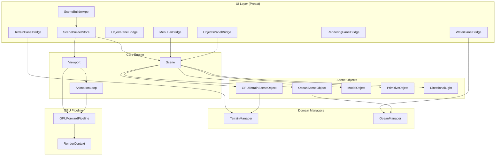
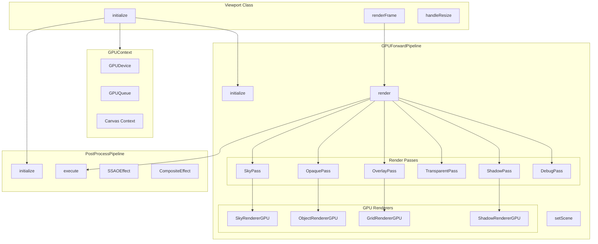
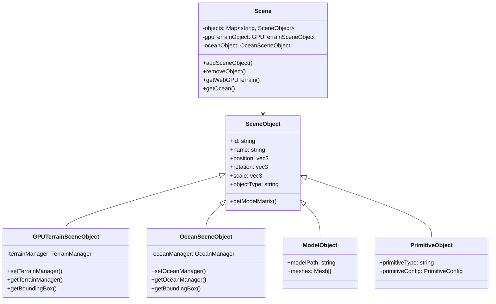
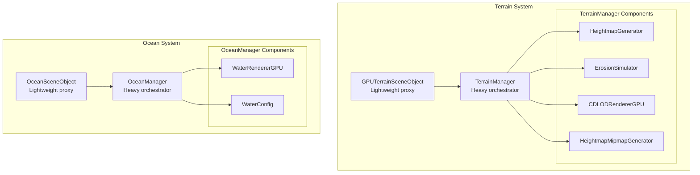
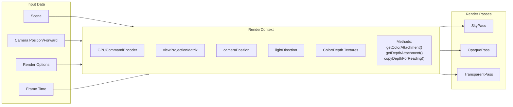
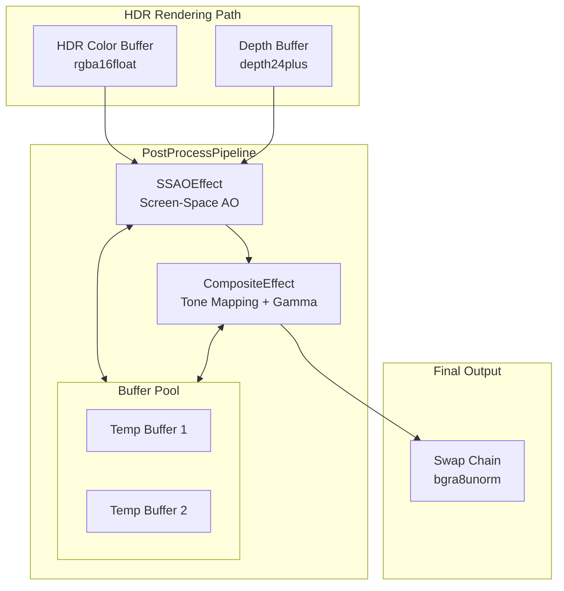
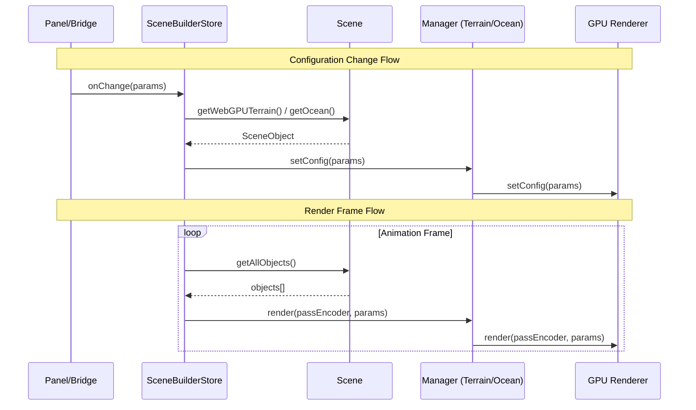
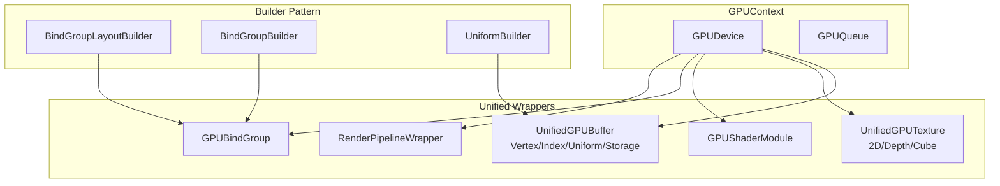

# WebGPU Rendering Architecture

This document provides a comprehensive overview of the WebGPU rendering flow in the 3D experiment project.

## High-Level Architecture Overview



## Render Pass Execution Flow

```mermaid
flowchart TD
    subgraph ForwardPipeline["GPUForwardPipeline.render()"]
        Start([Frame Start])
        CreateContext[Create RenderContext]
        
        subgraph Passes["Render Passes (Priority Order)"]
            SkyPass[1. SkyPass<br/>Priority: 100]
            ShadowPass[2. ShadowPass<br/>Priority: 200]
            OpaquePass[3. OpaquePass<br/>Priority: 300]
            TransparentPass[4. TransparentPass<br/>Priority: 400]
            OverlayPass[5. OverlayPass<br/>Priority: 500]
            DebugPass[6. DebugPass<br/>Priority: 600]
        end
        
        PostProcess[PostProcessPipeline]
        End([Frame End])
    end

    Start --> CreateContext
    CreateContext --> SkyPass
    SkyPass --> ShadowPass
    ShadowPass --> OpaquePass
    OpaquePass --> TransparentPass
    TransparentPass --> OverlayPass
    OverlayPass --> DebugPass
    DebugPass --> PostProcess
    PostProcess --> End
```



## Detailed Component Flow



## Scene Object Hierarchy



## Manager Pattern (Terrain & Ocean)



## Render Context Data Flow



## Pass Dependencies & Data Access

```mermaid
flowchart TB
    subgraph RenderContext["RenderContext (ctx)"]
        CTX_Scene[ctx.scene]
        CTX_Options[ctx.options]
        CTX_Encoder[ctx.encoder]
        CTX_Textures[ctx.colorTexture<br/>ctx.depthTexture]
    end

    subgraph SkyPass["SkyPass"]
        Sky_Render["skyRenderer.renderSunSky()<br/>skyRenderer.renderHDRSky()"]
    end

    subgraph ShadowPass["ShadowPass"]
        Shadow_Terrain["scene.getWebGPUTerrain()<br/>.getTerrainManager()"]
        Shadow_Render["shadowRenderer.renderShadowMap()"]
    end

    subgraph OpaquePass["OpaquePass"]
        Opaque_Terrain["scene.getWebGPUTerrain()<br/>.getTerrainManager()"]
        Opaque_TerrainRender["terrainManager.render()"]
        Opaque_ObjectRender["objectRenderer.render()"]
    end

    subgraph TransparentPass["TransparentPass"]
        Trans_Ocean["scene.getOcean()<br/>.getOceanManager()"]
        Trans_Terrain["scene.getWebGPUTerrain()<br/>.getTerrainManager()"]
        Trans_Render["oceanManager.render()"]
    end

    subgraph OverlayPass["OverlayPass"]
        Overlay_Render["gridRenderer.render()"]
    end

    CTX_Scene --> Shadow_Terrain
    CTX_Scene --> Opaque_Terrain
    CTX_Scene --> Trans_Ocean
    CTX_Scene --> Trans_Terrain
    
    CTX_Options --> Sky_Render
    CTX_Encoder --> Shadow_Render
    CTX_Encoder --> Opaque_TerrainRender
    CTX_Encoder --> Trans_Render
    CTX_Encoder --> Overlay_Render
```



## Post-Processing Pipeline



## UI ↔ Core Communication



## GPU Resource Hierarchy



## File Organization

```
src/
├── core/
│   ├── Scene.ts                    # Scene management, object registry
│   ├── gpu/
│   │   ├── GPUContext.ts          # WebGPU device/queue management
│   │   ├── GPUBuffer.ts           # UnifiedGPUBuffer wrapper
│   │   ├── GPUTexture.ts          # UnifiedGPUTexture wrapper
│   │   ├── GPUBindGroup.ts        # Bind group builders
│   │   ├── GPURenderPipeline.ts   # RenderPipelineWrapper
│   │   ├── pipeline/
│   │   │   ├── GPUForwardPipeline.ts  # Main render orchestrator
│   │   │   ├── RenderContext.ts       # Per-frame render state
│   │   │   ├── RenderPass.ts          # Base pass class
│   │   │   └── passes/
│   │   │       └── index.ts           # Sky/Shadow/Opaque/Transparent/Overlay/Debug
│   │   ├── renderers/
│   │   │   ├── SkyRendererGPU.ts
│   │   │   ├── ObjectRendererGPU.ts
│   │   │   ├── GridRendererGPU.ts
│   │   │   ├── ShadowRendererGPU.ts
│   │   │   └── WaterRendererGPU.ts
│   │   ├── postprocess/
│   │   │   ├── PostProcessPipeline.ts
│   │   │   └── effects/
│   │   └── shaders/
│   │       ├── *.wgsl
│   │       └── terrain/*.wgsl
│   ├── sceneObjects/
│   │   ├── SceneObject.ts         # Base class
│   │   ├── GPUTerrainSceneObject.ts
│   │   ├── OceanSceneObject.ts
│   │   ├── ModelObject.ts
│   │   └── PrimitiveObject.ts
│   ├── terrain/
│   │   ├── TerrainManager.ts      # Terrain orchestrator
│   │   ├── CDLODRendererGPU.ts
│   │   ├── HeightmapGenerator.ts
│   │   └── ErosionSimulator.ts
│   └── ocean/
│       ├── OceanManager.ts        # Ocean orchestrator
│       └── index.ts
└── demos/sceneBuilder/
    ├── Viewport.ts                # Main application viewport
    ├── components/
    │   ├── bridges/               # Preact ↔ Core adapters
    │   ├── panels/                # UI panels
    │   └── state/
    │       └── SceneBuilderStore.ts
    └── ...
```

## Key Design Patterns

### 1. Manager Pattern (Terrain/Ocean)
- **Scene Object**: Lightweight proxy in scene graph for selection/raycasting
- **Manager**: Heavy orchestrator owning GPU resources and rendering logic
- **Benefit**: Separation of scene membership from rendering concerns

### 2. Render Pass Pattern
- **BaseRenderPass**: Abstract interface with `execute(ctx: RenderContext)`
- **Priority System**: Passes sorted by priority for correct ordering
- **RenderContext**: Shared per-frame state passed to all passes

### 3. Builder Pattern (GPU Resources)
- `UniformBuilder`: Fluent API for uniform buffer construction
- `BindGroupLayoutBuilder`: Declarative bind group layout creation
- `BindGroupBuilder`: Type-safe bind group creation

### 4. Bridge Pattern (UI)
- **Panel Components**: Pure Preact components (no core dependencies)
- **Bridge Components**: Connect panels to SceneBuilderStore and managers
- **Store**: Central state management with signals
